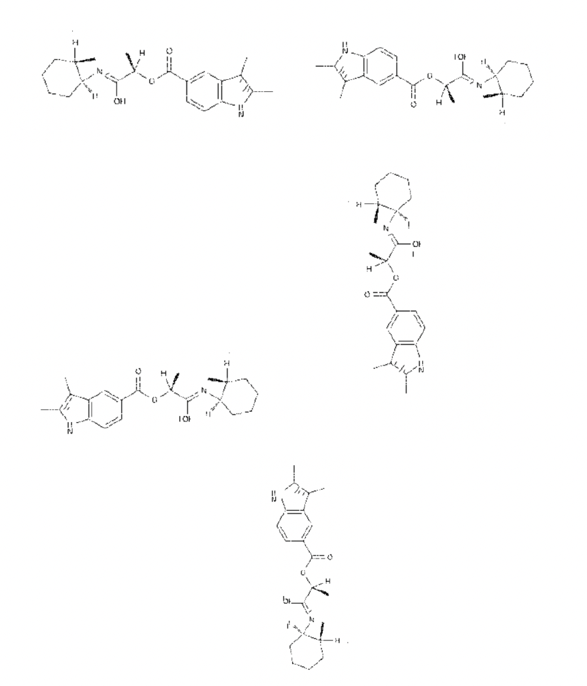
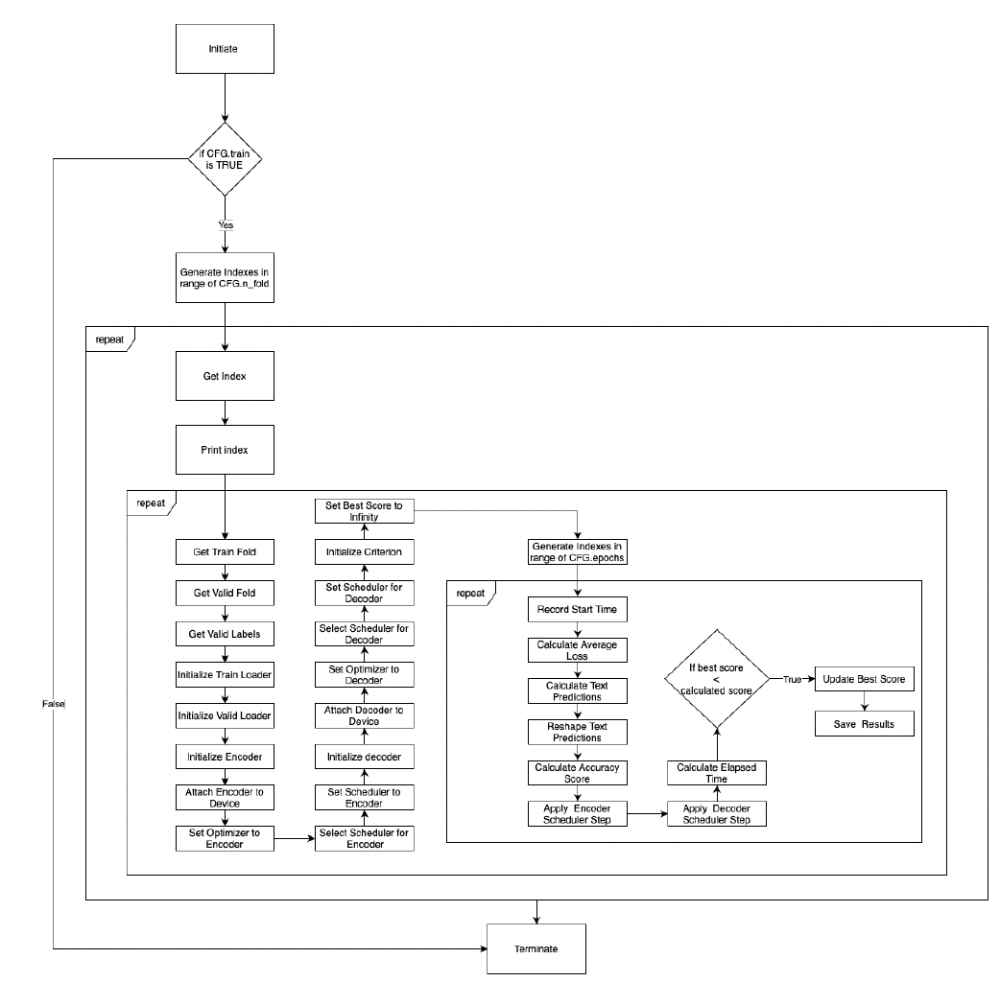

<!-- TABLE OF CONTENTS -->
<details open="open">
  <summary>Table of Contents</summary>
  <ol>
    <li>
      <a href="#about-the-project">About The Mini-Project</a>
      <ul>
        <li><a href="#built-with">Built With</a></li>
      </ul>
    </li>
    <li>
      <a href="#getting-started">Getting Started</a>
      <ul>
        <li><a href="#prerequisites-and-installation">Prerequisites and Installation</a></li>
      </ul>
    </li>
  </ol>
</details>

<!-- ABOUT THE PROJECT -->
## About The Project

Information contained in printed or digitized chemical structures is required to research and develop new chemical products. Currently, few automatic recognition and translation systems of structural formulas exist in the industry leading to a lot of manual effort spent
on their identification and analysis. Many older printed publications remain on paper due to the amount of effort required to accurately translate them to a computer-friendly format. Machine learning solutions are in development to address this problem yet such issues as drawing style variations and low-quality are not well-accounted for in existing research. This leads to unstable model predictions of incoming data from older sources. Hence, the purpose of this study is to develop a low-quality and position-agnostic chemical structure
recognition model to address the problem. 

The study analyzes and develops several feature extraction methods, custom augmentations that preserve correct textual orientations,
applications of random noise to translate images to sequences using LSTM networks with attention. The results show that InceptionV3 extraction method performs significantly better than Autoencoders due to its depth and several differently scaled filters. The baseline image-to-sequence model achieves a minimum Levenshtein score of circa 19 characters on the validation set, which constitutes approximately a 10% error rate. Custom augmentations and lowering of image quality do not significantly impact the score, which can be due to text ordering, random placement of noise and model overfitting on the original dataset.

### Built With

The following main Python libraries were used to build this project:
- <a href="https://pytorch.org">PyTorch</a>
- <a href="https://albumentations.ai">Albumentations</a>
- <a href="https://scikit-learn.org">Sklearn</a>

<!-- GETTING STARTED -->
## Getting Started

This is a list of instructions on how anyone can get started with this code.

### Prerequisites & Installation

1. Clone the repo
```sh
    git clone https://github.com/lynxalytics/chemical-burst.git
```
2. Install libraries, if not installed
```sh
    pip install albumentations
    pip install torch
```

<!-- USAGE EXAMPLES -->
## Usage

To run this code, run the Jupyter notebooks in order. The first Jupyter notebook creates an encoder-decoder network as a baseline. The encoder is InceptionV3, whilst the decoder is an LSTM with Attention. The second notebook builds on the first by adding custom image augmentations that preserve textual orientation & create more variety of chemical structure images. The third notebook adds random noise to the images to test modeling on low quality data.

The original and processed files will be saved under ``data`` folder in your current working directory. The accompanying research paper is attached.

Here are samples of images and their custom augmentations:





